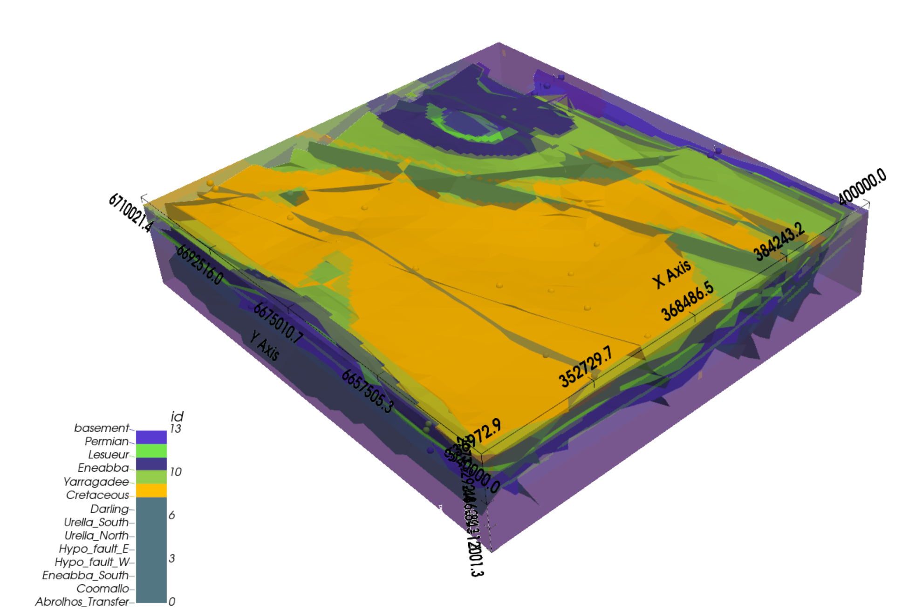
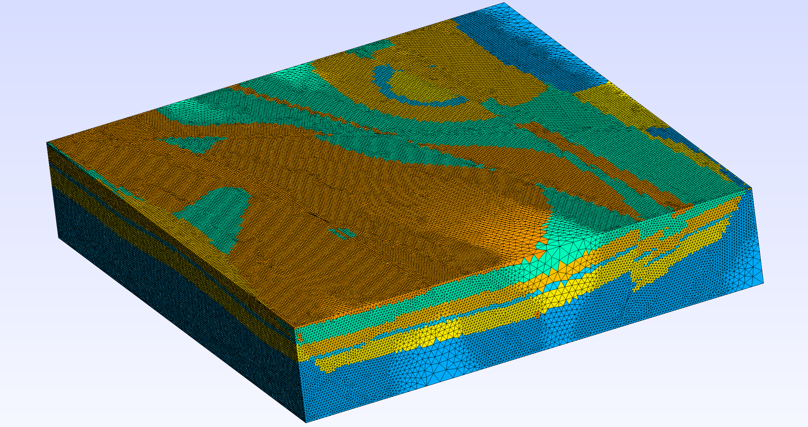
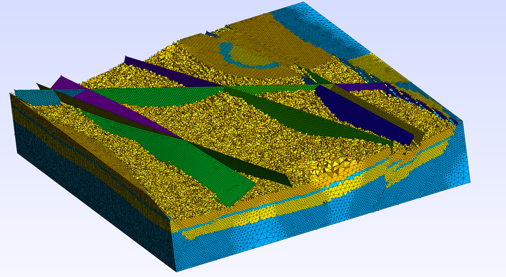

# GM2FEM: Geological Model to Finite Element Mesh

GM2FEM is a workflow for converting geological models into 3D Gmsh meshes that include fault surfaces and sedimentary layers.
It bridges geological modeling tools (e.g. GemPy) with numerical simulation frameworks such as MOOSE for coupled THM (Thermo-Hydro-Mechanical) reservoir modeling.
> ⚠️ **Work in Progress:** This project is under active development. Features and interfaces may change.
***
### Main Script: GM2FEM_mesh_generator.py

This script processes the geological data and constructs the 3D mesh automatically.
It performs the following key steps:
1.  Reads input text files describing fault surfaces and sedimentary layers.
2.  Fits smooth B-spline surfaces to fault point clouds using GmshBSplineSurfaceBuilder.py.
3.  Creates and fragments a 3D box around the geological model domain.
4.  Refines the mesh locally near fault planes for better numerical accuracy.
5.  Assigns sedimentary layers as physical volumes based on their lithology IDs.
6.  The output is a high-quality .msh file ready for import into numerical solvers such as MOOSE.

***
### Input Data Format

Fault Surfaces:
- Each fault must be exported as a discrete set of points saved in individual files named fault_XXX.txt.
- Each file should contain three columns representing Cartesian coordinates:
```bash
X   Y   Z
```
Sedimentary Layers:
The geological model’s lithology should be exported as a regular 3D grid and saved in a single file named ids_points.txt.
This file must contain:
```bash
X   Y   Z  ID
```
where, each row’s X, Y, Z are the actual coordinates of a structured grid node covering the entire model domain, and ID represents the lithology or sedimentary layer index at each grid point.

***
### Helper Script: helper.py

The helper.py script is designed specifically to extract the necessary data from GemPy models.
It reads the computed scalar fields, level sets, and lithology block IDs, then exports:

1. Fault surface points (fault_XXX.txt)
2. Sedimentary layer grid (ids_points.txt)
3. Bounding box (bbox.txt)
4. Model resolution (resolution.txt)

To export this data directly from your GemPy model after computation (e.g. after gp.compute_model()), simply add:
```bash
import helper

helper.export_fault_grids_and_ids_txt(
    geo_model,
    out_dir="gmsh_io",
    num_faults=3,      # number of faults in the model
    n_lattice=60,      # grid size for surface fitting
    mc_step=2          # step size for faster extraction (2, 4, ...)
)
```
***
### Output

After execution, the workflow generates:

- A fully meshed 3D model (.msh format)
- Fault surfaces and sedimentary layers labeled as physical groups
- Mesh refinement near fault planes
- Files ready for direct use in FEM simulations within frameworks like MOOSE

<p align="center">
  
</p>

<p align="center">
  
</p>

<p align="center">
  
</p>
